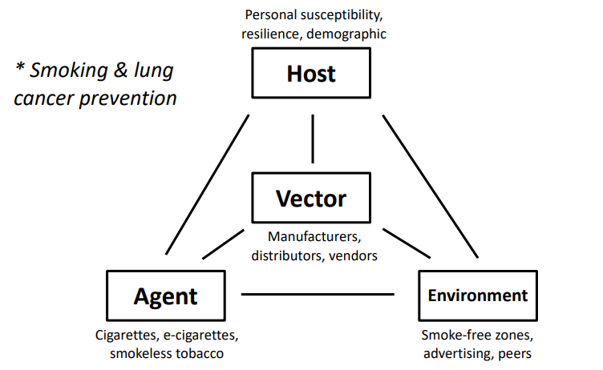

You can also still use R!

```{r}
library(tidyverse)

plot_df =
  tibble(
    x = runif(100),
    y = 1 + 2 * x + rnorm(100)
  )

plot_df |> 
  ggplot(aes(x = x, y = y)) + 
  geom_point()
```

# Here's a new section

This is an example of the epi triad:

